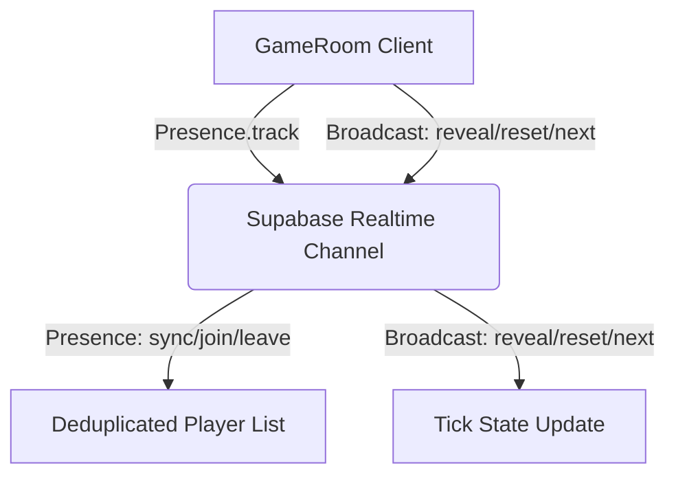

# Planning Poker - Architecture and Implementation Document

This document outlines the architecture, design choices, technologies used, and the synchronization model developed for the real-time, multi-deck Planning Poker web application.

---

## 🚀 Technology Stack & Rationale

| Technology | Purpose | Why We Used It |
| :--- | :--- | :--- |
| **React (TypeScript)** | Core Application Library | Provides a component-driven architecture for splitting the landing page, setup page, and game table. TypeScript ensures type safety for players, deck types, and game states. |
| **Vite** | Frontend Tooling & Bundling | Replaced slow classic bundling with lightning-fast Hot Module Replacement (HMR) and optimized building. |
| **Supabase** | Backend-as-a-Service | Provides managed database storage (PostgreSQL) and real-time synchronization layers without spinning up a custom Node.js/Socket.io backend. |
| **WebSockets (via Supabase Realtime)** | Real-time Multiplayer Layer | Synchronizes user connections, live voting states, and organizer-driven commands (revealing, resetting, changing tasks) with sub-second latency. |
| **TailwindCSS** | Interface Styling | Used utility classes to implement high-end dark gaming themes, glowing panels, custom gradients, and smooth slide-up animation profiles. |

---

## 🛰️ Real-Time & Synchronization Architecture

The multiplayer architecture is divided into two parts: **Presence** (persistent user state) and **Broadcast** (fleeting, immediate events).

### 1. Dynamic Presence & Stable Session Keying
* **Stale Avatars & Multi-Tab Mitigation**: When users open the same game in multiple tabs, traditional presence systems duplicate their avatar. We solved this by generating a stable `playerId` stored in the client's `localStorage` via the `PlayerSession` helper.
* The Supabase presence channel is keyed explicitly by this unique `playerId`. Multiple tabs sharing the same player ID will update the same slot, ensuring exactly **one unique avatar** per seat at the table.
* **Functional States**: Player votes (`voteDev`, `voteQa`, `hasVoted`) are updated inside functional React state updates to prevent race conditions during rapid concurrent voting.

### 2. The Tick-Counter Event Pattern (Broadcasts)
* React's `useState` drops updates if the new value matches the previous state (e.g. going from `'playing'` to `'playing'`). This caused "Next Round" or "Reset Votes" to fail after the first round because state transitions were ignored.
* We refactored the events to use **monotonically increasing tick counters** (`revealTick`, `nextRoundTick`, `resetVotesTick`). A tick value always changes (e.g., `1 ➔ 2 ➔ 3`), forcing React to execute synchronization effects every time.
* **Local-First Rendering**: The system no longer waits for a network round-trip. When the organizer triggers an action:
  1. The tick counter is updated locally, updating the organizer's UI instantly.
  2. The event is broadcast to peers (with `self: false` configured on the channel to avoid redundant events).

---

## 📂 Key Code Components

1. **[`useGameRoom.ts`](file:///c:/SelfStudyProjects/PlanningPocker/src/hooks/useGameRoom.ts)**: Core React Hook managing Supabase Realtime channel setup, subscription lifecycles, and event dispatch logic.
2. **[`GameRoom.tsx`](file:///c:/SelfStudyProjects/PlanningPocker/src/pages/GameRoom.tsx)**: Game orchestrator containing local states, standard deviation math, and rendering coordination.
3. **[`session.ts`](file:///c:/SelfStudyProjects/PlanningPocker/src/lib/session.ts)**: LocalStorage helper preserving user identity (names and avatars) across setup and gameplay refreshes.
4. **[`GameBoard.tsx`](file:///c:/SelfStudyProjects/PlanningPocker/src/components/GameBoard.tsx)**: Arranges player cards around the poker table and displays organizer buttons in the table center.
5. **[`VotingDock.tsx`](file:///c:/SelfStudyProjects/PlanningPocker/src/components/VotingDock.tsx)**: Handles selection decks (Days, Hours, Story Points, Powers of 2, T-Shirt) and the organizer's Estimation Type selector.
